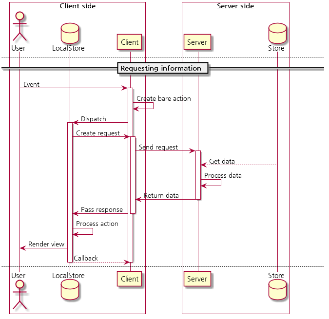
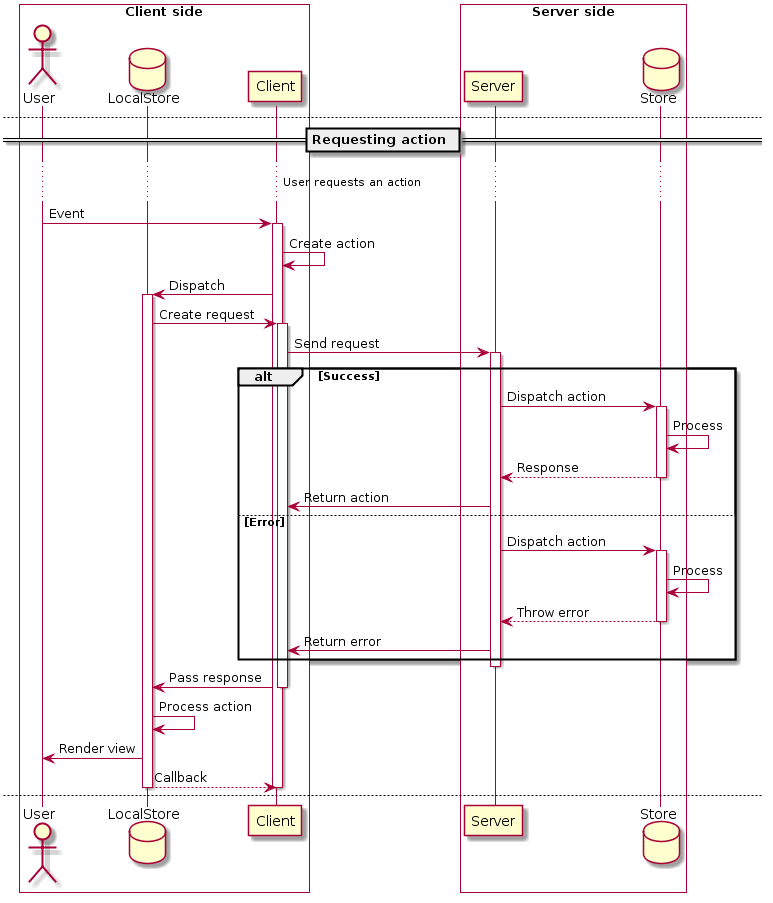
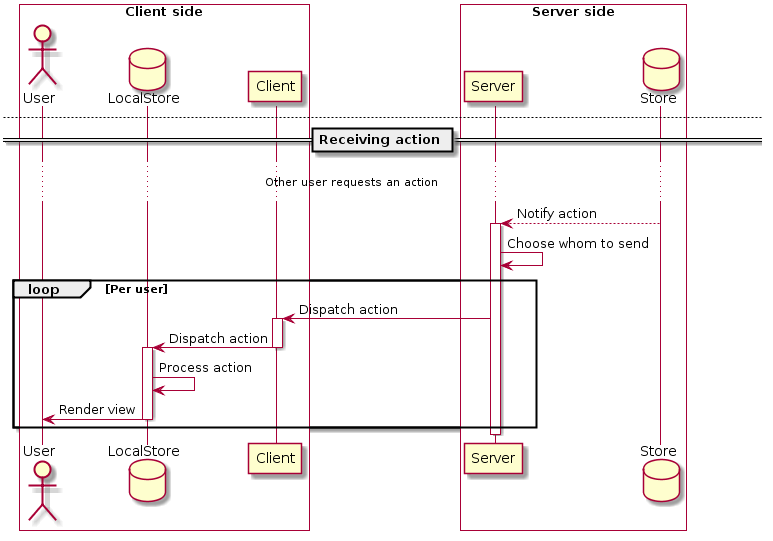

# Action

Action is a single action executed by server, client, or both.

There are three 'classes' of the action. This class MUST be specified in the
action's `meta.class`.

- `internal` (Default) - Internal action. All actions doesn't specifying
  the class SHOULD be processed as this class.
- `read` - Read-only action, aka fetching, 'GET'.
- `write` - Write action, aka 'POST', etc.

## Internal action

Internal actions are internal only, which means it can't get sent to another
clients, or the server. This means that the Connector Middleware MUST NOT
send these action to the remote.

## Read action

Read actions are like 'GET' request of HTTP. It's only used for fetching
information from the remote.

It's mainly issued by the client, sent to the server. However, it SHOULD NOT be
sent to other than the server and the issued client. Roughly speaking, it
SHOULD NOT be sent to 3rd party.

In order to send a request, Client and server MUST follow this procedure:

1. Client creates an action containing request headers and dispatch it.
   The payload of the action can contain any data, like HTTP's body. However,
   server should be able to digest that information.
2. After dispatching the request action, the connector middleware catches it
   by reading it's `meta.class` and send it to the server.
3. Server parses the action and reads required data from the store.
   If server can't find required data, or the action data is malformed,
   then server can send an action with `error: true`.
4. Server creates the response action and puts processed data and send it
   as a callback. If callback isn't possible, actions may contain its unique
   ID to identify the origin of the action.
5. The connector middleware receives the action and send it to the reducer.
6. After the reducer finishes processing it, the connector middleware may
   execute a callback.

Since it is only used to retrieve missing information from the remote,
server isn't likely to send this action, because server already have all the
information. However, server MAY implement sending this action in order to
communicate with other server, or the database, or the client.
Clients also MAY implement processing this action like the server.

## Write action

Write actions are like 'POST' request of HTTP. It is used to acutally alter
the remote store.

Since it alters the server's store, server MUST validate the request action.
Also, server MUST send response action to other clients who have the
outdated data.

In order to send a request, Client and server MUST follow this procedure:

1. Client creates an action and dispatch it. Since the action directly goes
   to the reducer, action's payload should be digestable by the reducer.
2. After dispatching the request action, the connector middleware catches it
   by reading it's `meta.class` and send it to the server.
3. Server dispatches the retrieved action to the reducer. However, middlewares
   can interrupt this.
4. Reducer processes the action. However, if reducer can't process it, reducer
   can throw an exception.
5. Retrieve returned dispatched result and state. Dispatched result MUST be an
   action or a promise returning the action. if exception is thrown instead,
   the server rejects the action and return the result to the client.
6. Server send the returned action as a callback. If callback isn't possible,
   actions may contain its unique ID to identify the origin of the action.  
   After sending the response to the client, server sends the action to
   other clients who have the changed data. This will be explained later.
7. The connector middleware receives the action and send it to the reducer.
8. After the reducer finishes processing it, the connector middleware may
   execute a callback.

However, since this kind of action actually modifies the store, server should
broadcast the action to other clients. Server MAY broadcast it to all the other
users, or it MAY check and send to those who have the outdated data.
(RECOMMENDED)

Broadcasting executed action follows this procedure:

1. Server's connector middleware notifies that the 'write action' has been
   executed.
2. For each user, server checkes and sends the action to the client. Server
   may decide to remove sensitive information from the action.
3. The client receives the action and dispatch it. Since it already has been
   validated from the server, connector middleware MUST NOT catch the action
   and send it to the server, as it'll create an infinite loop.
4. Reducer process the action and pass it to the view.
